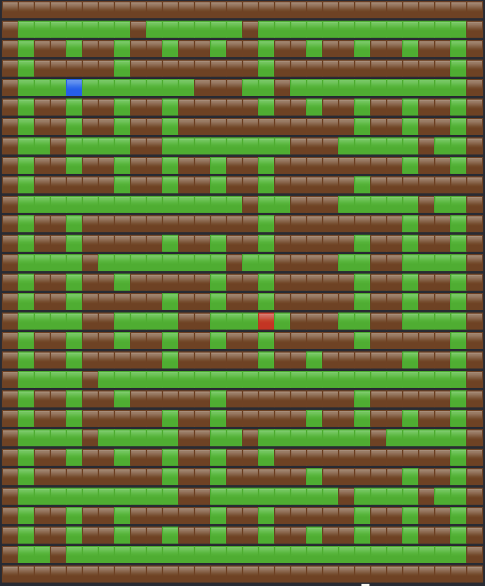
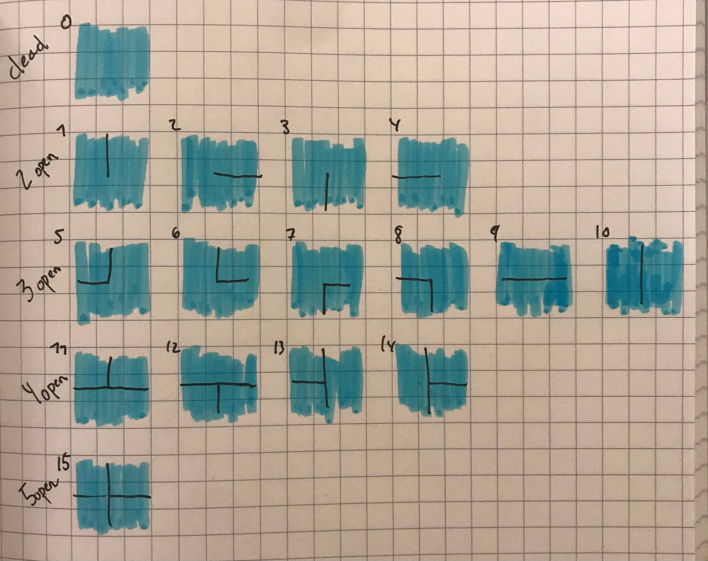

# ParametrizedMazeGen

A tool to generate parametrized maze.

## MazeGeneration

This section contains details on the Python maze generator.

### Version

Python 3.8.6

### Create virtualenv

OS X:

```bash
python3 -m venv maze-env
```

Windows:

```bash
virtualenv --python "<path/to/python>" maze-env
where python # Get python path
```

### Activate virtualenv

OS X:

```bash
source maze-env/bin/activate
```

Windows:

```bash
.\maze-env\Scripts\activate
set-executionpolicy RemoteSigned # For Powershell (step 1)
.\maze-env\Scripts\activate.ps1 # For Powershell (step 2)
```

### Install requirements

```bash
pip3 install -r requirements.txt
pip install -r requirements.txt
```

### Generate

Note you need to support Unicode 12.0 on your command line tool to use pretty=True option

```bash
python src/generate.py # Default pretty=True
python src/generate.py pretty=True
python src/generate.py pretty=False
```

### Pretty Output Example



### Implementation Details

### Types of maze cells

Here an image of all 16 possible maze types that are used during generation.



## Model-driven Engineering

This makes reference to the _mde_ folder. MDE part works only on Windows.

### Set up with build-in workspace

Make sure you have installed all required tools:

1. Create Epsilion Interim workspace on the folder mde/mde_workspace
2. Import > General > Existing Projects into Workspace, select Maze
3. Import > General > Existing Projects into Workspace, select MazeT
4. Right-click on Maze/metamodel/Maze.ecore > Register EPackages
5. Right-click on Maze/metamodel/Maze.ecore > Eugenia > Generate GMF editor
6. Import > Run/Debug > Launch Configurations > Select mde/archive folder

### Set up into a separate workspace

1. Import > General > Archive File > Select mde/archive/mde_project.zip
2. Import > Run/Debug > Launch Configurations > Select mde/archive folder
